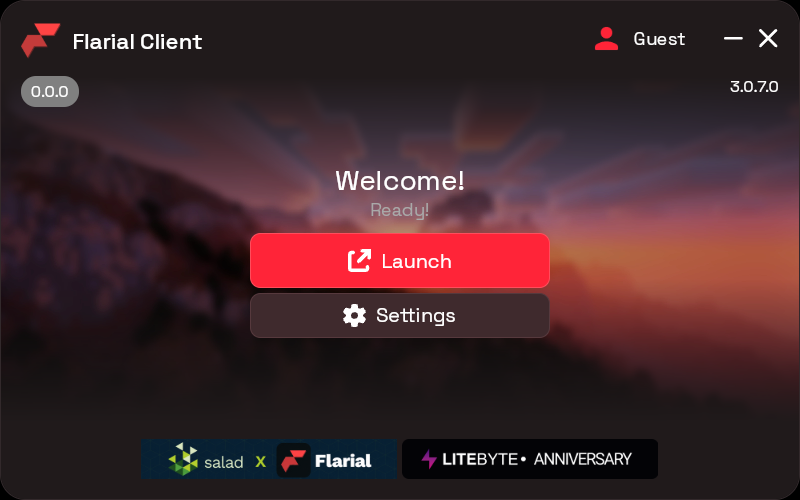

# Flarial Launcher for Linux

The Flarial Client launcher for Minecraft Bedrock Edition (Windows GDK build), running natively on Linux through Wine/Proton.



## Features

- Flarial OAuth sign-in
- Release, Beta or Custom client DLL
- Install, select and delete Minecraft Bedrock GDK versions, downloaded with your own Microsoft account
- Xbox Live sign-in inside the game (friends, servers, Realms)
- Wine/Proton engine and Wine prefix are downloaded and managed for you
- The launcher updates itself

## Requirements

- Linux x86_64 with a Vulkan-capable GPU and working Vulkan drivers
- `python3`, `zstd`, `openssl`, `tar`, `gzip`, `bash`, `script`, `setsid`, `stty`, `xdg-open`, `xprop`, and `curl` or `wget`
- A Microsoft account that owns Minecraft for Windows (Bedrock)
- Disk space: engine ~860 MB, Steam Linux Runtime ~900 MB, plus the game itself
- A desktop session (X11/XWayland) and `xdg-open`; `xprop` (`xorg-xprop` / `x11-utils`) to clean up a game process that outlived its window; optional `secret-tool` (libsecret) for credential storage

## Install

```sh
curl -fsSL https://cdn.flarial.xyz/launcher/linux/install.sh | sh
```

Arch Linux / CachyOS (AUR):

```sh
yay -S flarial-launcher-bin
```

The installer needs no root. Re-running it updates or repairs the install. Downloads are verified by size, SHA-256 and an ECDSA signature. See [packaging/README.md](packaging/README.md).

### Uninstall

```sh
sh install.sh --uninstall            # keeps games, prefix and logins
sh install.sh --uninstall --purge    # also deletes ~/.local/share/Flarial/Linux (asks first; --yes skips)
```

For the AUR package run `sudo pacman -R flarial-launcher-bin` first, then the commands above for the per-user copy.

## Using it

1. Open the launcher and sign in to Flarial (Settings > Accounts).
2. Sign in to your Microsoft account (Settings > Accounts > Microsoft), then open Settings > Versions and download a Minecraft version.
3. Press Launch. The first launch is slow: the engine and Steam runtime are downloaded and the Wine prefix is created. Later launches are much faster.

## Where data lives

Everything is under `~/.local/share/Flarial/Linux` (or `$XDG_DATA_HOME/Flarial/Linux`):

| Path | Contents |
|---|---|
| `games/` | Downloaded Minecraft versions (Settings > General > Open Installation Directory) |
| `compatdata/pfx` | Wine prefix; the Flarial client folder lives inside it (Settings > General > Open Client Folder); game data, worlds and packs are in its `AppData/Roaming/Minecraft Bedrock` (Open Data Directory, or use the Import buttons for .mcpack/.mcworld/.mcaddon/.mctemplate files) |
| `proton/`, `umu/`, `xodus/` | Engine, umu-run and xodus-cli |
| `xodus-home/`, `msa/`, `winegdk-preauth/` | Microsoft/Xbox login state |
| `logs/` | Logs |
| `settings.json` | Optional advanced settings (`inject_delay`, `inject_settle_ms`, `custom_env`, `ray_tracing`, `diagnostics`) |

## Troubleshooting

Logs are in `~/.local/share/Flarial/Linux/logs`: `launcher.log`, `launch.log` (launch timeline), `minecraft.log` (game output), `injector.log`, plus `xodus.log`, `xbox.log`, `prefix.log`, `setup.log` and `updater.log`.

- **"Device group is full"**: your Microsoft account has reached its device limit. Remove a device at <https://account.microsoft.com/devices/content> and try again.
- **Game does not start or crashes at the graphics stage**: check that Vulkan works (`vulkaninfo`), that your driver is current, and read `minecraft.log`.
- **First launch takes a long time**: expected, see above. Do not close the launcher while it is installing.
- **Game refuses to launch with a license error**: the account must own Minecraft for Windows, and a license check happens on every launch, so you need to be online.

## How it works

- The game is downloaded with `xodus-cli` (a separate subprocess) using your Microsoft account, and decrypted on every launch after a license check. Game files are never redistributed.
- The game runs on a prebuilt GDK-Proton engine (Wine with WineGDK, DXVK, vkd3d-proton) inside the Steam Linux Runtime via `umu-launcher`.
- A device-code Xbox login feeds Xbox Live tokens into the Wine prefix so in-game sign-in works.
- The Flarial client DLL is injected with a small Windows injector run under Wine, after its dependencies are loaded. Like the Windows launcher, it hands the client your Flarial account access token (when signed in) through the loader thread, see [docs/account-payload.md](docs/account-payload.md). A fake Windows PasswordVault in the prefix is still synced with launcher credentials for client builds that read their refresh token from it.

Architecture:

- `src/Flarial.Launcher`: Avalonia UI and view models, ported 1:1 from [flarialmc/Flarial.Launcher](https://github.com/flarialmc/Flarial.Launcher)
- `src/Flarial.Runtime`: cross-platform backend (HTTP, OAuth, DLL download, version registry, settings) that talks to the OS only through `Platform/Platform.cs`
- `src/Flarial.Runtime.Linux`: Linux backend, modules `Xodus`, `Xbox`, `Engine`, `Prefix`, `Launch`, `Injection`, `Update`; native helpers in `Native/` (`injector.c` (loads the DLLs and delivers the account payload), `flarial_vault.cpp`, `flarial_bcrypt_shim.cpp`, see `docs/wine-bcrypt-oaep.md`)
- `src/Flarial.Runtime.Windows`: original Windows sources, synced with upstream and not built (its `FlarialClient.Loader` has the Linux twin in `src/Flarial.Runtime/Core/FlarialClient/FlarialClient.Loader.cs`)

## Building from source

Requires the .NET 10 SDK.

```sh
dotnet build src/Flarial.Launcher
dotnet run --project src/Flarial.Launcher
dotnet publish src/Flarial.Launcher -c Release -r linux-x64 --self-contained -p:PublishSingleFile=true -o publish
```

`Native/flarial_vault.dll`, `Native/flarial_bcrypt_shim.dll` (`build-bcrypt-shim.sh`) and `Native/injector.exe` are prebuilt and committed (embedded resources); rebuild them with `MSVC_BIN=<path to your msvc-wine bin/x64> src/Flarial.Runtime.Linux/Native/build-vault.sh` (and `build-injector.sh`). Building them in CI is a future improvement.

Checks (run them with a scratch data directory so they never touch your install: `T=$(mktemp -d); XDG_DATA_HOME=$T HOME=$T Flarial.Launcher --selftest-<name>`): `--selftest-dependencies`, `--selftest-engine`, `--selftest-xodus`, `--selftest-updater` and `--selftest-payload` (JSON encoding and the client's acceptance rules). `tests/payload-probe/run.sh` additionally injects a probe DLL into a stand-in game in a scratch Wine prefix and reads the payload back with `GetThreadDescription`, like the client does; `tests/bcrypt-shim/run.sh` tests the bcrypt shim.

Developer only: `FLARIAL_LINUX_SEED_FROM=<BedrockOnLinux dir>` links an existing engine/umu/xodus/game and copies its logins instead of downloading them. Do not use it for normal installs.

## Releasing

Pushing a commit whose subject starts with `release:` triggers the CI release. See [docs/updates.md](docs/updates.md).

## Contributing

The UI must match the upstream Windows launcher. Do not restyle it; any necessary difference is recorded in [docs/ui-deviations.md](docs/ui-deviations.md). Backend changes should go through the interfaces in `Platform/Platform.cs`.

## License

GPL-3.0, see [LICENSE](LICENSE), matching upstream Flarial.Launcher. Third-party components and their licenses are listed in [CREDITS.md](CREDITS.md).

## Disclaimer

This project is not affiliated with, endorsed by or sponsored by Mojang Studios or Microsoft. Minecraft is a trademark of Mojang/Microsoft. You must own a legitimate copy of Minecraft for Windows; the launcher downloads the game from Microsoft's servers under your own license and does not bypass licensing. Piracy is not supported.
